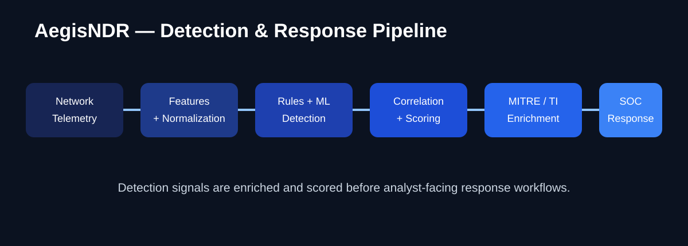

# AegisNDR

## Network Detection & Response Research Platform

**AegisNDR** is a Python-based cybersecurity research platform for analyzing network activity, detecting suspicious behavior, correlating security events, enriching findings, and presenting SOC-oriented response workflows.

> **Project status:** Educational / experimental. Not presented as production-ready.

### What this project demonstrates

AegisNDR follows a security-analysis pipeline:

**Telemetry → feature extraction → detection → correlation → threat scoring → enrichment → SOC workflow**

### Detection capabilities

- Network-flow and packet-derived feature analysis
- Rule and signature-based detection
- Isolation Forest anomaly detection
- Event correlation and attack-chain context
- Threat scoring
- Threat-intelligence enrichment
- MITRE ATT&CK mapping
- Demonstration response workflows
- SOC-style API and dashboard components

### Architecture

Network Telemetry
→ Flow Generation / Feature Extraction
→ Rules / Signatures + ML Anomaly Detection
→ Event Correlation
→ Threat Scoring
→ Threat Intel + MITRE ATT&CK
→ SOC Dashboard / Response Workflow

### Local setup

cp .env.example .env
pip install -r requirements.txt
python main.py --mock

Simulation:
python main.py --mock --simulate

Live capture may require elevated privileges:
sudo python main.py --interface eth0

Docker / Compose support is included in the repository.

### Security boundaries

- Keep .env, API keys, JWT secrets, and credentials out of source control.
- Supply JWT_SECRET through deployment-time secret management.
- Keep automated response disabled during development.
- Restrict high-impact actions to explicitly managed and authorized assets.
- Treat ML detections as investigation signals, not proof of compromise.
- Run capture and response functions only in authorized environments.

See SECURITY.md and docs/SECURITY_REVIEW.md.

### Technology

Python · FastAPI · Scapy · scikit-learn · PostgreSQL · Redis · Elasticsearch · JWT/RBAC · Docker

### My role

**Hassan Faris — Cybersecurity Engineer | SOC | Network Security**

Focused on network detection logic, event analysis, threat scoring, MITRE ATT&CK mapping, and security workflow design.

### Links

- GitHub: https://github.com/faris7assan
- LinkedIn: https://www.linkedin.com/in/hassan-faris
- Portfolio: https://hassanhamedfaris69.base44.app

### Authorized-use notice

Use packet capture, scanning, and response capabilities only on systems and networks you own or are explicitly authorized to monitor.
